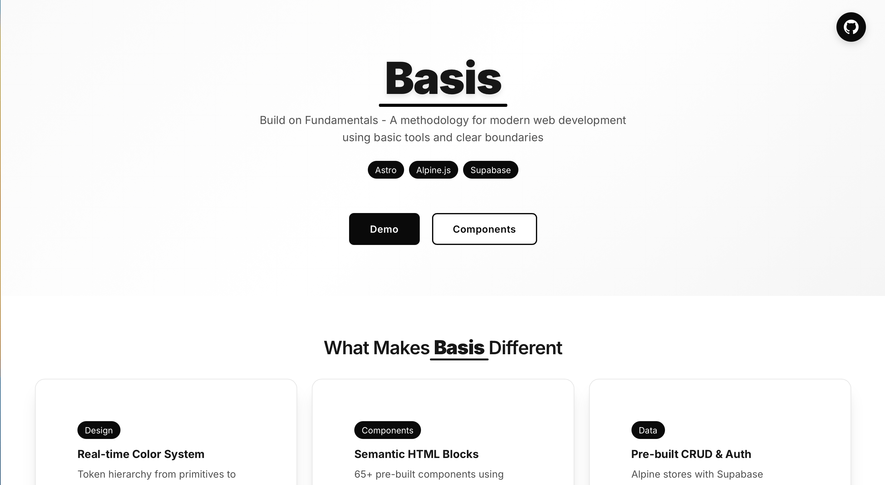

# PASTA Stack Starter Kit

🚀 A modern web development starter template combining **Pine UI**, **Astro**, **Supabase**, **Tailwind CSS**, and **Alpine.js** for fast, interactive web applications.

## 🌟 Live Demo

**Demo:** [https://zhengyishen0.github.io/aha-stack-starter](https://zhengyishen0.github.io/aha-stack-starter)



> Replace with your actual GitHub Pages URL after deployment

## ✨ What's Included

- ✅ **40+ Pine UI Components** - Complete component library
- ✅ **GitHub Actions CI/CD** - Automatic deployment to GitHub Pages
- ✅ **Comprehensive Test Suite** - Individual test pages for all components
- ✅ **Dynamic Configuration** - Works with any GitHub username/repo
- ✅ **Mobile Responsive** - All components work on mobile devices
- ✅ **Zero Config Deployment** - Just push to deploy

## 🚀 Project Structure

Inside of your Astro project, you'll see the following folders and files:

```text
/
├── public/
│   └── favicon.svg
├── src
│   ├── assets
│   │   └── astro.svg
│   ├── components
│   │   └── Welcome.astro
│   ├── layouts
│   │   └── Layout.astro
│   └── pages
│       └── index.astro
└── package.json
```

To learn more about the folder structure of an Astro project, refer to [our guide on project structure](https://docs.astro.build/en/basics/project-structure/).

## 🎨 Pine UI Components

This project includes a comprehensive collection of UI components from Pine UI, converted and optimized for the PASTA stack (Pine UI + Astro + Supabase + Tailwind CSS + Alpine.js):

### Pine Marketing Components:

- **HeroSideBySide**: Side-by-side hero layout with text and image
- **HeroCentered**: Centered hero section with optional image below
- **HeaderWithNav**: Complete header with navigation and hero content
- **HeaderDark**: Dark-themed header with gradient background and newsletter signup

### Pine Interactive Components:

- **MonacoEditor**: Full-featured code editor with syntax highlighting, IntelliSense, and 15+ language support
- **Button**: Customizable buttons with multiple variants and colors
- **Modal**: Responsive modal dialogs with Alpine.js integration
- **Dropdown**: Interactive dropdown menus with keyboard navigation
- **Tabs**: Tabbed interface components
- **Accordion**: Collapsible content sections
- **And 35+ more components** - see `/src/components/pine/` for the complete collection

### Usage Examples:

#### Pine Marketing Components:

```astro
---
import { HeroSideBySide, HeaderWithNav } from '@/components/pine-marketing';
---

<HeaderWithNav
  logo="Your Brand"
  navItems={[
    { text: "Home", href: "/", active: true },
    { text: "Features", href: "/features" }
  ]}
  heroTitle="Start Crafting Your Next Great Idea"
  heroDescription="Simplifying the creation of landing pages..."
  primaryButtonText="Get Started"
  primaryButtonHref="#start"
/>
```

#### MonacoEditor Component:

```astro
---
import { MonacoEditor } from '@/components/pine';
---

<!-- Basic JavaScript Editor -->
<MonacoEditor
  id="code-editor"
  language="javascript"
  theme="vs-dark"
  height="400px"
  value="console.log('Hello World');"
/>

<!-- Python Editor with Custom Configuration -->
<MonacoEditor
  language="python"
  theme="vs-light"
  height="300px"
  fontSize={16}
  minimap={false}
  wordWrap="on"
  readOnly={false}
  placeholder="# Enter your Python code here..."
/>

<!-- Form Integration -->
<form>
  <MonacoEditor
    name="userCode"
    language="typescript"
    height="500px"
    @monaco-change="handleCodeChange($event)"
  />
</form>
```

#### Key MonacoEditor Features:

- **15+ Programming Languages**: JavaScript, TypeScript, Python, Rust, Go, Java, C#, HTML, CSS, JSON, YAML, SQL, and more
- **3 Built-in Themes**: Dark (`vs-dark`), Light (`vs-light`), High Contrast (`hc-black`)
- **IntelliSense & Code Completion**: Full VS Code-like editing experience
- **Syntax Highlighting & Error Detection**: Real-time validation and error highlighting
- **Customizable Options**: Font size, line numbers, minimap, word wrap, read-only mode
- **Alpine.js Integration**: Reactive data binding and event handling
- **Form Compatible**: Works seamlessly with form submissions
- **CDN Loading**: No build dependencies, loads Monaco from CDN
- **Auto-resize**: Responsive layout support

Test the MonacoEditor component at: `/test/monacoeditor`

For detailed documentation and examples, see `/src/components/pine-marketing/README.md`.

## 🧞 Commands

All commands are run from the root of the project, from a terminal:

| Command                   | Action                                           |
| :------------------------ | :----------------------------------------------- |
| `npm install`             | Installs dependencies                            |
| `npm run dev`             | Starts local dev server at `localhost:4321`      |
| `npm run build`           | Build your production site to `./dist/`          |
| `npm run preview`         | Preview your build locally, before deploying     |
| `npm run astro ...`       | Run CLI commands like `astro add`, `astro check` |
| `npm run astro -- --help` | Get help using the Astro CLI                     |

## 🚀 GitHub Pages Deployment

This project is configured for automatic deployment to GitHub Pages using GitHub Actions.

### Setup Instructions:

1. **Push your code to GitHub**:

   ```bash
   git add .
   git commit -m "Add GitHub Pages deployment"
   git push origin main
   ```

2. **Enable GitHub Pages**:
   - Go to your repository on GitHub
   - Navigate to **Settings** → **Pages**
   - Under "Source", select **GitHub Actions**

3. **Automatic Deployment**:
   - The workflow will automatically trigger on pushes to the `main` branch
   - Your site will be available at: `https://your-username.github.io/your-repo-name`

### Manual Deployment:

### Configuration Notes:

- The project automatically detects your GitHub username and repository name
- No manual configuration needed for deployment
- Works with any repository name or GitHub account
- The configuration is in `.github/workflows/deploy.yml`

## 🎯 Tech Stack Overview

Our PASTA stack is carefully chosen for optimal developer experience and application performance:

### Core Technologies

- **🚀 Astro** - Static site generator with component islands architecture
- **🗄️ Supabase** - Backend-as-a-Service with real-time database and authentication
- **⚡ Alpine.js** - Lightweight reactive framework for frontend interactivity
- **🎨 Pine UI** - Complete component library built for Alpine.js
- **🎨 Tailwind CSS** - Utility-first CSS framework
- **📝 Markdown Content** - Content management via Astro Content Collections
- **🔄 GitHub Actions** - CI/CD for automatic deployment to GitHub Pages

### Why This Stack?

**Astro + Component Islands**: Astro provides excellent performance through its islands architecture, allowing us to hydrate only the interactive components we need. This gives us the best of both worlds - static site speed with dynamic functionality where needed. Astro's component system eliminates code duplication by making all UI elements reusable across pages.

**Supabase Integration**: Supabase replaces traditional backend development with a complete BaaS solution. It provides real-time database functionality, built-in authentication, and row-level security policies. This eliminates the need for separate backend services while maintaining full database capabilities.

**Alpine.js + ES6 Modules**: Alpine.js provides reactive frontend functionality with a minimal footprint. We use ES6 module imports rather than CDN scripts for better reliability and Alpine.store() pattern for clean global state management. This approach eliminates timing issues and provides a more maintainable codebase.

**Pine UI Components**: Pine UI gives us a complete set of production-ready components specifically designed for Alpine.js. All components are customizable with variants, colors, and sizes, following consistent design patterns throughout the application.

**Tailwind CSS**: Provides utility-first styling that integrates seamlessly with our component system. We use Tailwind for rapid UI development while maintaining design consistency across all Pine UI components.

**Content Collections**: Astro's Content Collections with frontmatter allow us to manage landing page content in Markdown files. Structured data (hero sections, features, testimonials) goes in frontmatter while long-form content uses markdown body, then renders with getEntry() and <Content /> components.

## 🔧 Working with Alpine.js

### Alpine.js Setup & Plugin Usage

Alpine.js is included via ES6 modules with all major plugins. The setup is in `src/lib/alpine.js`:

```javascript
// Alpine.js Plugins
@alpinejs/mask         // Input masking and formatting
@alpinejs/intersect    // Intersection observer functionality
@alpinejs/persist      // Data persistence across page loads
@alpinejs/focus        // Focus management utilities
@alpinejs/collapse     // Smooth collapse/expand animations
@alpinejs/anchor       // Anchor positioning
@alpinejs/morph        // DOM morphing for smooth updates
@alpinejs/sort         // Sortable lists and drag-and-drop
@alpinejs/resize       // Element resize detection

// Alpine.js Core
alpinejs@3.14.9
```

#### Basic Alpine.js Usage

```astro
<!-- Simple counter component -->
<div x-data="{ count: 0 }" class="p-4">
  <button x-on:click="count--">-</button>
  <span x-text="count"></span>
  <button x-on:click="count++">+</button>
</div>

<!-- Form with validation -->
<div x-data="{ email: '', valid: false }" class="space-y-4">
  <input
    x-model="email"
    x-on:input="valid = email.includes('@')"
    type="email"
    placeholder="Enter email"
    class="w-full px-3 py-2 border rounded"
  />
  <button
    x-show="valid"
    class="px-4 py-2 bg-blue-500 text-white rounded"
  >
    Submit
  </button>
</div>
```

#### Using Alpine.js Plugins

```astro
<!-- @alpinejs/mask - Input formatting -->
<input x-mask="(999) 999-9999" placeholder="Phone number" />
<input x-mask="99/99/9999" placeholder="MM/DD/YYYY" />

<!-- @alpinejs/persist - Data persistence -->
<div x-data="{ theme: $persist('light') }">
  <button x-on:click="theme = theme === 'light' ? 'dark' : 'light'">
    Toggle Theme: <span x-text="theme"></span>
  </button>
</div>

<!-- @alpinejs/intersect - Scroll animations -->
<div x-intersect="$el.classList.add('animate-fadeIn')">
  Content that animates in when scrolled into view
</div>

<!-- @alpinejs/collapse - Smooth animations -->
<div x-data="{ open: false }">
  <button x-on:click="open = !open">Toggle</button>
  <div x-show="open" x-collapse>
    <p>This content will smoothly collapse/expand</p>
  </div>
</div>

<!-- @alpinejs/focus - Focus management -->
<div x-data="{ open: false }" x-on:keydown.escape="open = false">
  <button x-on:click="open = true">Open Dialog</button>
  <div x-show="open" x-trap="open">
    <input x-ref="firstInput" />
    <button x-on:click="open = false">Close</button>
  </div>
</div>
```

### Supabase Integration

Supabase provides our backend functionality with real-time database capabilities and authentication:

```javascript
// Supabase Client Setup
import { createClient } from '@supabase/supabase-js'
export const supabase = createClient(supabaseUrl, supabaseKey)
```

#### Alpine.js + Supabase Integration

```astro
<!-- Real-time todo app with Alpine.js + Supabase -->
<div x-data="$store.todo" x-init="init()">
  <!-- Authentication -->
  <div x-show="!isAuthenticated">
    <button @click="signInAnonymously()" :disabled="loading">
      <span x-text="loading ? 'Signing in...' : 'Sign In Anonymously'"></span>
    </button>
  </div>

  <!-- Todo Interface -->
  <div x-show="isAuthenticated">
    <form @submit.prevent="addTodo($refs.todoInput.value); $refs.todoInput.value = ''">
      <input x-ref="todoInput" type="text" placeholder="Add todo..." required>
      <button type="submit" :disabled="loading">Add</button>
    </form>

    <!-- Todo List -->
    <template x-for="todo in filteredTodos" :key="todo.id">
      <div class="flex items-center gap-3">
        <input type="checkbox" 
               :checked="todo.is_complete"
               @change="toggleTodo(todo.id, $event.target.checked)">
        <span x-text="todo.task"></span>
        <button @click="deleteTodo(todo.id)">Delete</button>
      </div>
    </template>
  </div>
</div>
```

### Best Practices

1. **State Management**: Use Alpine.store() for global state management
2. **Performance**: Leverage Alpine.js's `x-cloak` directive to prevent flash of unstyled content
3. **Accessibility**: Use Alpine.js focus management plugins for keyboard navigation
4. **Error Handling**: Implement proper error states in Alpine.js components
5. **Progressive Enhancement**: Start with working functionality, then enhance with reactive features

## 🔥 Supabase Integration

The PASTA stack includes a complete example of integrating Supabase with Alpine.js for real-time applications.

### Supabase Todo App Example

Visit `/supabase-todo` to see a fully functional todo application that demonstrates:

- **Anonymous Authentication**: Automatic sign-in for instant use
- **Real-time Updates**: Live synchronization with the database
- **Alpine.js State Management**: Complete CRUD operations via Alpine.store()
- **Client-side Architecture**: Direct Supabase integration without API routes
- **Row Level Security**: Supabase RLS policies enforced

#### Architecture Overview:

```
Frontend (Astro Page)
├── Alpine.js Store (Global State Management)
├── Supabase JS Client (Direct Database Access)
├── Authentication Handling
└── Real-time UI Updates
```

#### Key Features:

1. **Pure Frontend Approach**: No backend server or API routes required
2. **Alpine.store() Pattern**: Clean global state management
3. **ES6 Module Imports**: Reliable script loading and initialization
4. **Row Level Security**: Supabase RLS policies enforced
5. **Optimistic UI**: Loading states and error handling

#### Setting Up Your Own Supabase Project:

1. Create a new Supabase project at [supabase.com](https://supabase.com)
2. Enable anonymous sign-ins in Authentication settings
3. Create your database schema with RLS policies
4. Update the credentials in:
   - `/src/lib/supabase.js` (Supabase client configuration)
   - `/src/lib/alpine.js` (Alpine.js store with Supabase integration)

### Testing Components

Test your components at `/test/` routes:

- Basic Alpine.js: `/test/quick-test`
- Advanced interactions: `/test/advanced-test`
- Individual component tests: `/test/[component-name]`
